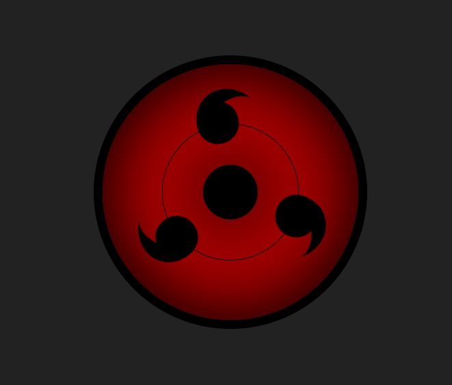

  

# Sharingan Loader

A pure CSS loading spinner shaped like the Sharingan eye from *Naruto*: three tomoe rotating around the pupil. No JavaScript and no images.

**Live demo:** https://fadyehabamer.github.io/Sharingan-Loader/

## Run locally

Open `index.html` in a browser. To reuse the loader, copy the `.sharingan` markup from `index.html` and the rules from `style.css`. The size is based on 400px (see `--tomoe-size`).

It announces itself as `role="status"` / "Loading", scales down on narrow phones and slows down when the OS *reduce motion* setting is on.
